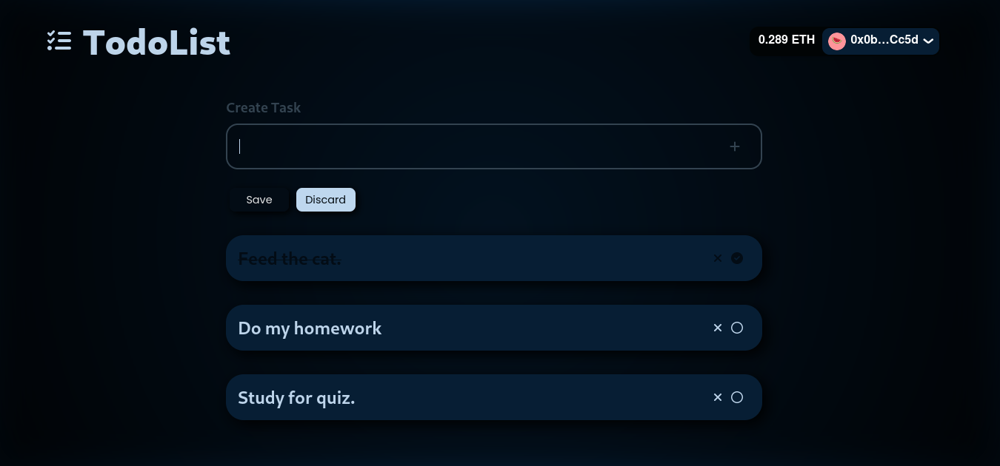

# Blockchain TodoList

This project is my first dive at learning how to make beautiful dApps using React and Web3 libraries.
The smart-contract was written from scratch and [deployed](https://rinkeby.etherscan.io/address/0xCA2ca507FdcdD212bDB3eECda2C1C10373524aF9#code) 
on the Rinkeby Ethereum TestNet.



## Deployment

### Deploying the smart contract

This project leverages Truffle to easily deploy and migrate the smart contracts. 
To do so, you need to do:

```bash
npm run dashboard
```

And on a **separate terminal**, do
```bash
npm run deploy
```

### Running the Frontend locally

First you need to compile the smart contract, to produce the contract ABI.
```
npm run compile_contracts
```

Then to run the frontend locally, do:
```bash
npm run dev
```

